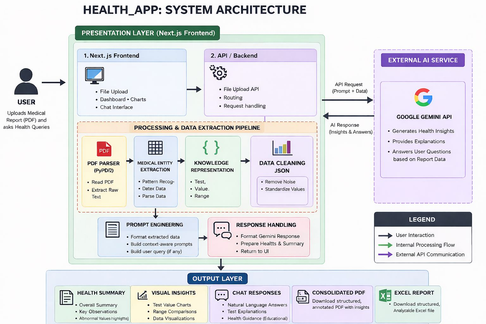
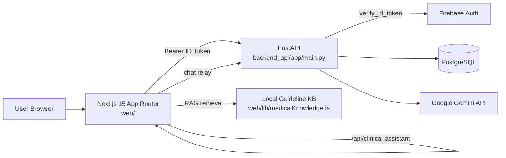

# Medical Report Analyzer

Production URL: https://health-app-lovat-eta.vercel.app/

## 1) What Is This?

Medical Report Analyzer helps families and caregivers organize medical reports that are usually scattered across PDFs, labs, and timelines. Instead of treating each report as a one-off file, it builds a longitudinal health history with normalized test names and values, then adds an AI clinical assistant to explain trends and answer report-specific questions.

### Product Screenshots

Add project screenshots in docs/screenshots/ using the filenames below:


## 2) Important Disclaimers

- This project is for informational support and engineering research.
- Clinical assistant outputs are not medical diagnosis, treatment, or professional advice.
- Extraction quality depends on source PDF text quality, OCR quality, and lab formatting.
- Reference ranges vary by lab and report context; human review is required.

## 3) Features

- Upload multiple lab reports at once and optionally merge with existing Excel/CSV data.
- Extract medical findings from PDFs into a structured record.
- Normalize noisy test names, categories, and statuses across report formats.
- Track results over time using profile and study timelines.
- Ask a clinical assistant questions grounded in report data and local guideline snippets.
- View trend charts and report summaries for faster interpretation.
- Export structured insights to PDF and Excel.
- Use secure login with Firebase token verification in backend APIs.
- Review admin-facing reliability and validation telemetry.

## 4) System Architecture



Mermaid reference diagram used in docs and design discussions:

<<<<<<< HEAD


=======

>>>>>>> 3386e4b5 (updated readme)

## 5) Tech Stack

- Frontend: Next.js 15, React 19, TypeScript, Tailwind-compatible styling.
- Backend: FastAPI, Python 3.11+, SQLAlchemy-based data layer.
- Auth: Firebase Authentication + Firebase Admin token verification.
- Database: PostgreSQL with JSONB payload storage for report analysis.
- AI: Google Gemini API for extraction, chat, and insight generation.
- Deployment: Vercel (frontend), containerized backend (Cloud Run-compatible scripts).

## 6) Getting Started / Local Development

### 6.1 Prerequisites

- Node.js 18+
- Python 3.11+
- PostgreSQL
- Firebase project and service account
- Gemini API key

### 6.2 Setup

```bash
git clone <repo-url>
cd Medical_Project

python3 -m venv .venv
source .venv/bin/activate
pip install -r requirements.txt

cd web
npm ci
cd ..

cp .env.example .env
cp web/.env.example web/.env.local
cp backend_api/.env.example backend_api/.env
```

### 6.3 Run Locally

Recommended:

```bash
./start.sh
```

Manual:

```bash
# backend
source .venv/bin/activate
uvicorn backend_api.app.main:app --reload --port 8000

# frontend
cd web
npm run dev
```

Logs:

```bash
./logs.sh backend
./logs.sh frontend
./logs.sh follow-backend
```

Stop services:

```bash
./stop.sh
```

## 7) Environment Variables

Environment templates are provided in:

- .env.example
- web/.env.example
- backend_api/.env.example

Critical variables you must set:

- GEMINI_API_KEY: Get this from Google AI Studio.
- DATABASE_URL: PostgreSQL connection string (local DB, Supabase, Neon, etc.).
- Firebase credentials:
  - Frontend NEXT_PUBLIC_FIREBASE_* values from Firebase Console -> Project Settings -> Your apps.
  - Backend FIREBASE_CREDENTIALS_PATH points to a Firebase Admin service account JSON downloaded from Firebase Console -> Project Settings -> Service Accounts.

Most important runtime variables by layer:

- Frontend
  - NEXT_PUBLIC_API_URL
  - NEXT_PUBLIC_API_BASE_URL
  - NEXT_PUBLIC_DIRECT_API_URL
  - NEXT_PUBLIC_FIREBASE_API_KEY
  - NEXT_PUBLIC_FIREBASE_AUTH_DOMAIN
  - NEXT_PUBLIC_FIREBASE_PROJECT_ID
  - NEXT_PUBLIC_FIREBASE_STORAGE_BUCKET
  - NEXT_PUBLIC_FIREBASE_MESSAGING_SENDER_ID
  - NEXT_PUBLIC_FIREBASE_APP_ID
- Backend
  - DATABASE_URL
  - GEMINI_API_KEY
  - API_REQUIRE_AUTH
  - API_CORS_ORIGINS
  - FIREBASE_PROJECT_ID
  - FIREBASE_CREDENTIALS_PATH or FIREBASE_SERVICE_ACCOUNT_JSON
  - FIREBASE_CLOCK_SKEW_SECONDS

## 8) Backend API Reference

Implemented FastAPI route groups under /api/v1:

- Auth
  - GET /auth/me
  - POST /auth/sync
- Profile and study management
  - GET /studies/profiles
  - POST /studies/profiles
  - GET /studies/profiles/{profile_id}/studies
  - POST /studies
  - GET /studies/dashboard
  - POST /studies/{study_id}/reports/save-analysis
  - GET /studies/{study_id}/combined-report
- Report analysis and history
  - POST /reports/analyze
  - POST /reports/analyze/stream
  - POST /reports/save
  - GET /reports/history
  - GET /reports/history/{analysis_id}
- Clinical and export
  - POST /reports/chat
  - POST /reports/insights
  - POST /reports/export/pdf
  - POST /reports/export/excel
- Utility
  - GET /health

## 9) Frontend Architecture

Frontend framework:

- Next.js 15 + React 19 + TypeScript App Router.
- Global auth provider in web/app/layout.tsx.
- Route protection via middleware cookie gate plus backend token validation.

Major frontend modules:

- Authentication
  - web/lib/auth-context.tsx
  - Firebase sign-in (Google + email/password), token provider wiring, backend sync.
- Dashboard and workflows
  - web/app/dashboard/page.tsx
  - Study flow modal, uploads, SSE progress UI, history retrieval, save-to-study.
- Visual components
  - TrendChart, AlertsByCategory, OrganizedDataTree, ClinicalChatPanel.
- Profile report view
  - web/app/dashboard/reports/[profileId]/page.tsx
  - Combined report access and study-level summarization.
- Admin metrics UI
  - web/app/admin/metrics/page.tsx
  - Quality/reliability cards, trend sparkline charts, failed PDFs, token usage.

## 10) Data Model

Main relational entities (PostgreSQL):

- users: Firebase identity mapping, admin flag, login metadata.
- report_analyses: saved analysis history snapshots.
- profiles: patient profiles under account owner.
- studies: logical longitudinal groups under profile.
- reports: uploaded report instances per study with normalized analysis_data (JSONB).
- metrics: telemetry table for validation and reliability metrics.

Schema assets:

- backend_api/sql/2026_03_24_study_management.sql
- backend_api/sql/2026_03_31_firebase_postgres_bootstrap.sql
- backend_api/sql/verify_postgres_schema.sql

## 11) Ingestion Pipeline

### 11.1 Upload and orchestration

- Frontend sends multipart uploads to:
  - POST /api/v1/reports/analyze
  - POST /api/v1/reports/analyze/stream (SSE progress mode)
- Streamed status includes stage and per-file events:
  - stages: validating, uploading, processing, saving
  - file steps: queued, extracting, parsing, done, failed

### 11.2 PDF extraction and LLM parsing

Backend service path:

- Extract raw text from PDF bytes using extract_text_from_pdf.
- Call Gemini extraction workflow through analyze_medical_report_with_gemini.
- Transform LLM output into tabular records via create_structured_dataframe.
- Merge optional existing CSV/XLSX data via process_existing_excel_csv.
- Consolidate patient identity and demographics across reports.

Core implementation:

- backend_api/app/services.py
- Helper_Functions.py

### 11.3 Normalization and data engineering

- Parse numeric values and dates.
- Normalize categories and test names to canonical forms.
- Resolve aliases and reduce semantic duplicates.
- Recompute health summary and body-system aggregations from normalized records.

Normalization entry points:

- backend_api/app/normalization.py
- web/lib/normalizeTest.ts
- scripts/migrateNormalize.ts

## 12) Clinical Assistant

Clinical assistant flow:

- Frontend sends question + session history + analysis identifier to /api/clinical-assistant.
- Route handler in web/app/api/clinical-assistant/route.ts can fetch full analysis from backend.
- Request context is enriched with timeline findings and local guideline retrieval.
- Enriched payload is forwarded to backend /api/v1/reports/chat.

RAG assets:

- web/lib/medicalKnowledge.ts
- web/lib/ragRetrieval.ts

## 13) Security

Authentication model:

- Firebase issues client ID tokens.
- Frontend sends Authorization: Bearer <token> for protected requests.
- Backend verifies token with Firebase Admin SDK and validates project/audience.

Security controls:

- CORS allowlist controlled by API_CORS_ORIGINS.
- Auth-required endpoints reject missing or invalid tokens.
- Clock-skew tolerant token verification via FIREBASE_CLOCK_SKEW_SECONDS.
- Middleware redirects unauthenticated users to /login.

## 14) Deployment

Live frontend:

- https://health-app-lovat-eta.vercel.app/

Repository deployment paths:

- Frontend hosting
  - Vercel with web/ as project root.
  - Configured by web/vercel.json and deploy/deploy_frontend_vercel.sh.
- Backend hosting
  - Cloud Run workflow script: deploy/deploy_backend_cloudrun.sh.
  - Dockerized backend via root Dockerfile and backend_api/Dockerfile.
- Database
  - PostgreSQL-compatible environments (Supabase/Neon patterns included).
  - Migration and verification scripts in deploy/.

Additional runbook:

- PRODUCTION_DEPLOYMENT_VERCEL_FIREBASE.md

## 15) Testing

Frontend and integration-oriented tests:

```bash
cd web
npx vitest
npx vitest run tests/clinical-assistant-context-retention.test.ts
npx vitest run tests/extraction-f1.test.ts
```

Optional metric-log test prerequisite:

```bash
export METRICS_TEST_TOKEN="<firebase-id-token>"
```

Operational smoke check:

```bash
BACKEND_URL="https://your-backend" \
FRONTEND_URL="https://your-frontend" \
./deploy/smoke_test.sh
```

## 16) Legacy Stack

If you are just exploring the project or testing extraction logic, the legacy Streamlit app is the fastest way to get started without setting up the full stack.

Legacy artifacts retained in repository:

- Streamlit entry points: main.py and Medical_Project.py.
- Shared extraction and analytics utilities: Helper_Functions.py.
- Legacy normalization helpers and mapping tests: unify_test_names.py and test_category_mapping.py.

The production path is Next.js + FastAPI, while legacy files remain useful for experimentation and reference implementations.

## 17) Contributing

Pull requests are welcome. For major changes, open an issue first to discuss what you would like to change.

<<<<<<< HEAD
## 16) License
MIT License
=======
Areas where contributions are especially welcome:

- Better OCR handling for scanned PDFs.
- Support for more lab report formats.
- Mobile-friendly frontend improvements.

## 18) License
>>>>>>> 3386e4b5 (updated readme)

